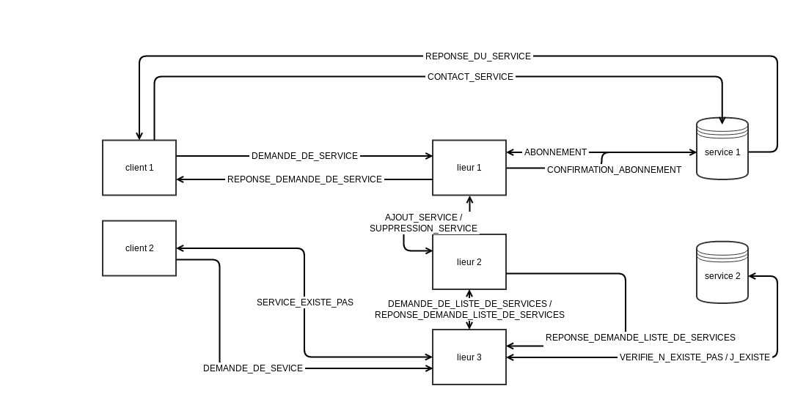

# Laboratoire de programmation repartie PRR

## Objectifs

- Concevoir et simplifier une architecture répartie.
- Analyser la problématique à un lieur de service.

### Enoncé

Dans ce laboratoire il est question de réaliser un lieur redondant entre des clients et des serveurs d'application.
L'objectif du lieur étant d'associer un client à un service fourni par l'un des serveurs d'application disponible.

### Comportement des clients

Le client doit obtenir l'adresse et le port du service fournit par un serveur auprès d'un lieur.
Par la suite il pourra alors utiliser l'adresse obtenue pour réclamer directement le service auprès du serveur.
Le client va choisir un lieur aléatoire et lui formuler sa demande. Si le lieur ne répond pas, le client va s'arrêter.
Si le service est inatteignable, le client le fera savoir au lieur et se terminera.

### Comportement des serveurs

Lors du demarrage, tout serveur s'inscrit auprès d'un lieur en lui transmettant son adresse IP, son port de service
ainsi que le type du service rendu.

### Protocole

##### CONTACT_SERVICE
Ce paquet est envoyé quand nous voulons faire une requête à un service.
il est constitué de la manière suivante : 
 > [type de paquet][longueur du message][message]

##### REPONSE_DU_SERVICE
Réponse du service questionné.
Envoyé après réception de <strong>« CONTACT_SERVICE »</strong>
il est constitué de la manière suivante : 
 > [type de paquet][longueur du message][message]

##### DEMANDE_DE_SERVICE
Ce paquet est envoyé à un lieur quand un client veux accéder à un service.
Il est constitué de la manière suivante : 
 > [type de paquet][type de service demandé]

##### REPONSE_DEMANDE_DE_SERVICE
Réponse envoyée par le lieur après une demande de service d'un client.
Envoyé après réception de <strong>« DEMANDE_DE_SERVICE »</strong>
Il est constitué de la manière suivante : 
 > [type de paquet][IP du service][port du service]

##### SERVICE_EXISTE_PAS
Cas client → lieur : Paquet envoyé au lieur si un service n'a pas été atteint par le client.
Il est constitué de la manière suivante : 
 > [type de paquet][type du service][IP du service][port du service]

Cas lieur → client : Paquet envoyé si le lieur ne connait pas le type de service demandé.
Envoyé après réception de <strong>« DEMANDE_DE_SERVICE »</strong>
Il est constitué de la manière suivante : 
 > [type de paquet]

##### ABONNEMENT
Demande d’adhésion d'un service à un lieur.
Il est constitué de la manière suivante :
 > [type de paquet][type de service]

##### CONFIRMATION_ABONNEMENT
Ce paquet est envoyé comme confirmation d’adhésion d'un service à un lieur, une fois ce paquet reçu par le service, ce dernier tournera dans une boucle infinie.
Envoyé après réception de <strong>« ABONNEMENT »</strong>
Il est constitué de la manière suivante :
 > [type de paquet]

##### DEMANDE_DE_LISTE_DE_SERVICES
Ce paquet est envoyé à un lieur quand un autre lieur démarre et met à jour sa liste de service.
Il est constitué de la manière suivante :  
 >[type de paquet]

##### REPONSE_DEMANDE_LISTE_DE_SERVICES
Ce paquet est envoyé en réponse à la demande de mise à jour d'un lieur.
Envoyé après réception de <strong>«DEMANDE_DE_LISTE_DE_SERVICES»</strong>  
Il est constitué de la manière suivante : 
 > [type de paquet][nombre de service][type de service][IP du service][port du service]

##### AJOUT_SERVICE
Ce paquet est envoyé par un lieur aux les autres lieurs après réception du paquet <strong>« ABONNEMENT »</strong>
Il est constitué de la manière suivante :
 > [type de paquet][type de service][IP du service][port du service]

##### SUPPRESSION_SERVICE
Ce paquet est envoyé arpès l’émission du paquet <strong>« VERIFIE_N_EXISTE_PAS »</strong> qui n'a pas donné de réponse <strong>« J_EXISTE »</strong>. Ce paquet est envoyé aux autres lieurs pour leur dire de supprimer le service incriminé.
Il est constitué de la manière suivante :
 > [type de paquet][type de service][IP du service][port du service]

#####  VERIFIE_N_EXISTE_PAS
Ce paquet est envoyé par le lieur après réception du <strong>« SERVICE_EXISTE_PAS »</strong>. Il est envoyé du lieur vers le service incriminé pour vérifier si ce dernier est bien injoignable. Il est constitué de la manière suivante : 
 >[type de paquet]

#####  J_EXISTE
Ce paquet est envoyé par le service après réception du paquet  <strong><strong>« VERIFIE_N_EXISTE_PAS »</strong></strong> il permet de confirmer son existence. Il est constitué de la manière suivante :
 >[type de paquet]

### Tests à effectuer

Le tableau suivant présente les tests qui seront effectués.

| **Tests** | **Resutats** | **Commentaires**  |  
| --- | --- | --- |
| Un lieur doit être obténu aléatoirement à partir d'une liste | succès | Aucun |
| Un lieur ou un serveur doit être redemarré aussitôt qu'il est tombé en panne  | - | Non pris en compte, redemarrage manuel |
| Après rédémarrage d'un lieur, il doit se mettre à jours par rapport aux autres lieurs disponibles   | succès | lancement du 1er lieur, lancment du serveur, lancment du second lieur. Message : 
 Nouveau service reçu:Service: id 1,ip 127.0.0.1, port 12347|
| Le client doit s'arrêter ou attendre un délai après qu'il redemande un service inconnu auprès d'un lieur   | succès | le client s'arrête si le lieur ne connais pas le service demandé |
| Le lieur doit repondre uniquement aux service existants   |  |  |
| Un client doit notifier un lieu d'un service non disponible   | succès |  |
| Après notification d'un client lieur doit mettre à jous sa table de service et la sychroniser avec les autres lieurs   |  |  |
|  Le lieur doit distribuer les services de même type de façon cyclique entre les serveurs   |  |  |
| Deux clients se connectent l'un apres l'autre (1 sec d'intervalle ) à un lieur pour l'informer que le service X est down (crash probable du au fait que le port d'ecoute du lieur sera occupé)   |  |  |
| client fait une demande de service au lieur alors que celui si est en verification d'existance d'un autre service   |  |  |
